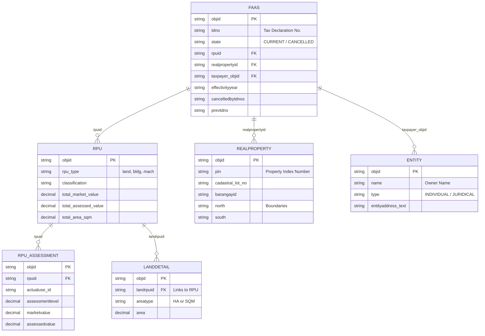

# ETRACS Database Layout (Real Property Assessment)

Based on the reverse-engineering we've done during the data sync process, here is the core layout of how the ETRACS database connects its Real Property Assessment (FAAS) records. 

ETRACS uses a highly normalized structure where the Tax Declaration, the physical land, the property unit, and the taxpayer are all separated into distinct tables.

### Table Breakdowns

#### 1. `faas` (Field Appraisal and Assessment Sheet)
This is the **central hub** of the tax declaration. It doesn't actually store the property value or the PIN! Instead, it acts as a binder that links the owner, the physical location, and the property valuation together.
*   **Key Data**: TD Number (`tdno`), Status (`state`), Effectivity Year (`effectivityyear`), and Cancellation details (`cancelledbytdnos`, `canceldate`).

#### 2. `realproperty`
This table represents the **physical, geographic piece of earth**. 
*   **Key Data**: PIN (`pin`), boundaries (`north`, `south`, `east`, `west`), Cadastral Lot Number, and Survey Number.
*   *Note: If an owner builds 3 houses on 1 lot, there will be 1 `realproperty` record, but 4 `faas` records (1 for land, 3 for buildings).*

#### 3. `rpu` (Real Property Unit)
This table represents the **taxable asset itself** (the land, the building, or the machinery).
*   **Key Data**: The type of asset (`rpu_type`), the General Revision Year (`ry`), and the absolute totals (`total_market_value`, `total_assessed_value`).

#### 4. `rpu_assessment`
Since a single property might have multiple uses (e.g., a lot that is 50% Residential and 50% Commercial), this table breaks down the `rpu` into its specific **line-item classifications**.
*   **Key Data**: Classification (e.g., RES, COM), Actual Use, Assessment Level %, and the specific computed values for that line item.

#### 5. `landdetail` (and `bldgdetail`, `machdetail`)
These tables hold the specific measurements and physical characteristics of the RPU. 
*   **Key Data**: This is where ETRACS explicitly defines if the area was measured in Hectares or Square Meters (`areatype` = "HA" or "SQM").

#### 6. `entity`
The central registry for all people and corporations.
*   **Key Data**: Taxpayer Name, Address, and Entity Type. ETRACS uses this so that if a person changes their name or address, it automatically updates across all their Tax Declarations.
